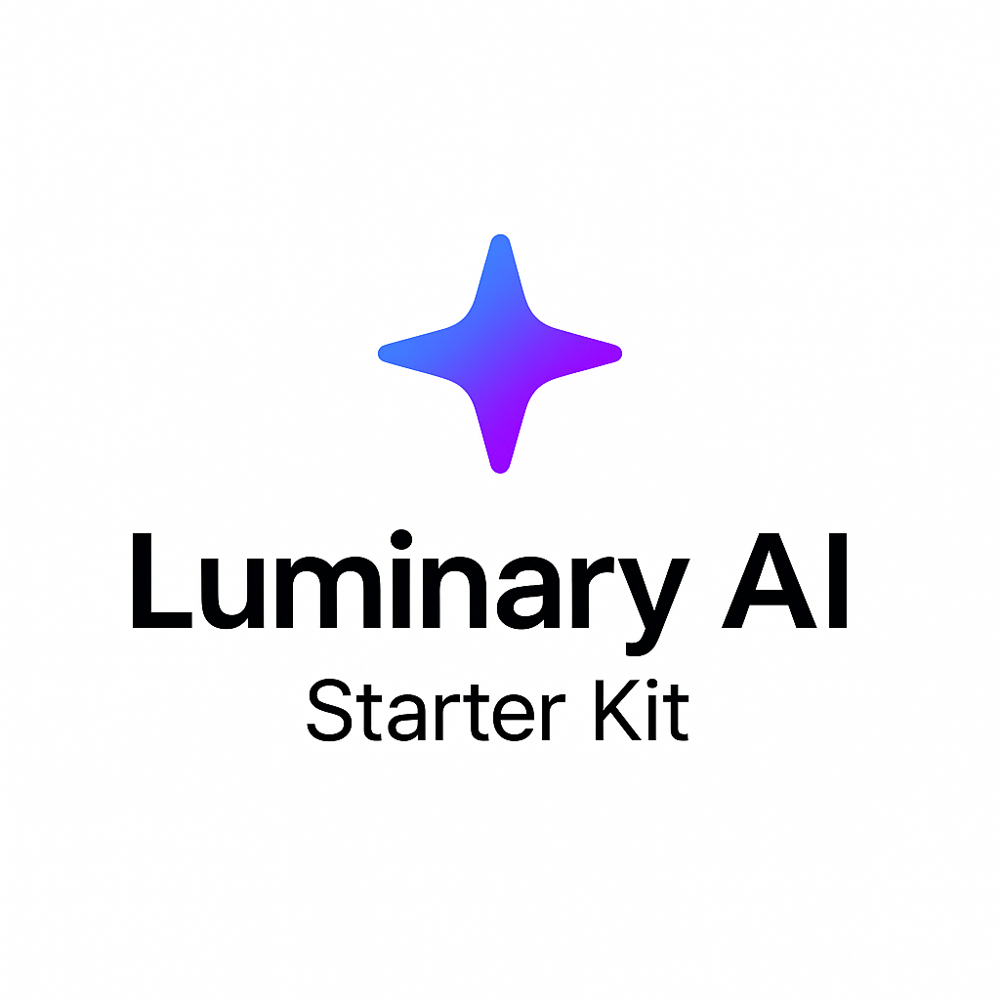

<p align="center" style="background: #ffffff; padding: 1rem; border-radius: 1rem;">
  
</p>

# Luminary AI Starter Kit

A fully-featured, production-grade AI chatbot interface built in **2 weeks** by a solo developer — inspired by the ChatGPT UI and designed to empower devs with advanced tooling **completely for free**.  

**Luminary** is your go-to AI development starter kit for creating powerful chat interfaces, featuring real-time streaming, custom models, tool usage, and more — all with a modern developer experience.

---

## 🚀 Project Overview

Luminary was created to fill the gap in AI chatbot tooling: most open-source implementations lack advanced features like tool calling or dynamic customization. This project provides those capabilities from the ground up — enabling devs and learners to build production-ready AI interfaces without restrictions.

Everything is geared for **educational use** and **developer freedom**.

---

## ✨ Features

- ✅ **Real-time message streaming**
- 🧠 **3 Custom AI models**, fully switchable
- 🎛️ **Advanced settings UI**:
  - Theme switching
  - Markdown toggle
  - “Dev mode” for enhanced prompts
  - Source toggle for web search visibility
  - Model selection
- ✍️ **Custom instructions**, including:
  - Bot name reference
  - Personality tuning
  - User interests and goals
- 🧩 **5 generative tools out of the box**:
  - Code execution (via Piston)
  - Chart generation (via Recharts)
  - Global weather data
  - Quote fetcher
  - Web search with private browsing (via SearXNG instances)
- 🛠️ **Optimized system prompt** for Deepseek R1 & LLaMA models via **Groq**
- 💬 **Sleek chat interface** with:
  - Animated streaming responses
  - File input (image/text support)
  - Stop & regenerate stream actions
  - Chat starter templates
  - Lucide iconography, modal design, and sidebar layout
- 🧪 **Error-safe streaming and regen fallback handling**
- 🌙 **Dark mode** & modern UI polish

---

## 🛠 Tech Stack

- **Next.js** – Modern React framework
- **TailwindCSS** – Utility-first styling
- **shadcn/ui** – Component primitives
- **Vercel AI SDK** – Handles chat, streaming, and tool calls
- **Groq** & **OpenRouter** – Free AI model providers
- **Vercel Blob** – File/image handling for models with attachment support

---

## 📦 Folder Structure

```
src/
├── app/                  # App layout and pages
│    └─ api/              # AI chat routes and system prompts
├── components/           # Main components
│   └── ui/               # shadcn/ui wrapped components
├── hooks/                # Custom React hooks
├── lib/                  # Tools, utils, and execution logic
├── store/                # LocalStorage-persistent stores
```

---

## ⚙️ Customization

- Swap models freely via the Vercel AI SDK. Easily plug in providers like OpenAI, Anthropic, xAI, Google, etc.
- Modify the system prompt to match your tone, toolset, or context window.
- Increase web search results and context slices based on your needs and token budget.

---

## 🧪 Notes

- The system was tested on a **6k token context window**, so tool output may be truncated on smaller models.
- Web search currently limits to **3 links** — increase this based on your needs and token budget.
- Authentication, chat saving and user management are not available on this kit.

---

## 🧭 Getting Started

> **Coming Soon.**  
You’ll just need a `.env` with your provider keys, followed by `pnpm install` and `pnpm dev`. More details coming in the setup guide.

---

## 📄 License

MIT — free to use, modify, and contribute.

Pull requests and feedback are welcome!

## 🤝 Contributing

We welcome contributions of all kinds — features, fixes, or ideas.

Please check out [CONTRIBUTING.md](./CONTRIBUTING.md) before getting started to ensure consistency and smooth collaboration.
